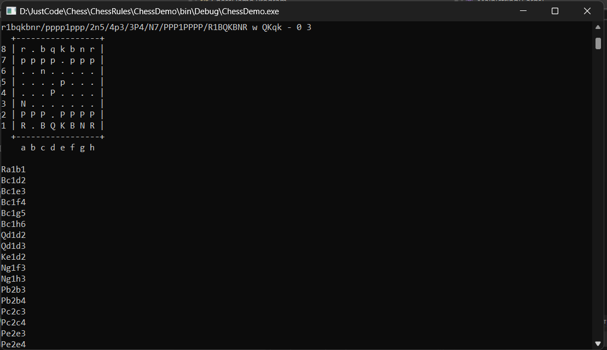

# DLL Library with Chess Rules

This library is engaged in search and check of the strength of available moves at a certain moment of the game

## Example



## Usage
- Create new instanse
``` CS
    Chess chess = new Chess();
```
``` CS
//return all valid moves
chess.YieldValidMoves()
```
```CS
//The function for taking a hike accepts a line in the form of a chess note(e2e4)
chess.Move(move);
```